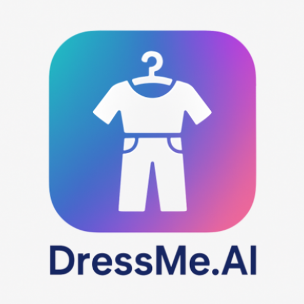

<p align="center">
  
</p>

<h1 align="center">Awesome DressMe.AI</h1>

<p align="center">
  <em>A curated collection of repositories powering the DressMe.AI app — an intelligent outfit recommendation system using VLM/LLM/ML pipelines for personalization.</em>
</p>

---

## Overview

**DressMe.AI** is an Android-based outfit recommendation app that personalizes clothing suggestions based on user preferences and visual attributes. It combines computer vision, LLMs, and mobile deployment for an end-to-end intelligent wardrobe experience.

This collection includes the app frontend, machine learning pipelines, annotation tools, and infrastructure code that make DressMe.AI modular, extensible, and production-ready.

---

## Repositories

### Frontend

- [`dressme-app`](https://github.com/DressMe-AI/dressme-app) – Main Android app with TensorFlow Lite model integration. Supports on-device outfit pairing and user feedback collection.

### Machine Learning

- [`dressme-ml-sagemaker`](https://github.com/DressMe-AI/dressme-ml-sagemaker) – Backend ML pipeline for training preference models using SageMaker.
- [`dressme-vlm`](https://github.com/DressMe-AI/dressme-vlm) – Vision-language model (ViT + LLM) for extracting structured clothing attributes from images.

### User Feedback / Annotation

- [`dressme-annotate`](https://github.com/DressMe-AI/dressme-annotate) – Jupyter notebooks for collecting and labeling user preferences to train the matching model.

### Infrastructure

- [`dressme-agentic`](https://github.com/DressMe-AI/dressme-agentic) – *(Private)* Agentic interface to personalize recommendations via LLM-based reasoning.
- [`dressme-ec2`](https://github.com/DressMe-AI/dressme-ec2) – *(Private)* EC2 setup and deployment infrastructure for inference and annotation hosting.

---

## Architecture Summary
```mermaid
flowchart TD
    A["🖼️ Image Upload: Wardrobe stored locally"] --> B
    A --> C
    B["🧠 ViT + LLM Extraction: Attribute mapping (OpenAI API)"] --> D
    C["👍👎 User Feedback: Like/dislike random pairs"] --> E
    D["🧾 Structured Input Vectors"] --> F
    E["🏷️ User Preference Labels"] --> F
    F["📈 Train Model on SageMaker"] --> G
    G["🛠️ Export to .tflite on S3"] --> H
    H["📱 Android App (Kotlin)"] --> I1
    H --> I2
    H --> I3
    I1["🤖 Mode 1: Auto Pairing"]
    I2["🧍 Mode 2: User-Guided Selection"]
    I3["💬 Mode 3: Prompt-Based Recommendation"] --> J
    J["🧠 LLM Agent (EC2 + OpenAI API)"] --> K
    K["🔍 Retrieve Similar Items via RAG"] --> L
    L["🎯 Filtered Wardrobe Items"] --> M
    M["📲 TFLite Inference in App"]


