  

<h1 align="center">Awesome DressMe.AI</h1>

  <em>A curated collection of repositories, developed by Erim Yanik, powering the DressMe.AI app — an intelligent outfit recommendation system using VLM/LLM/ML pipelines for personalization.</em>

---

## Overview

**DressMe.AI** is an Android-based outfit recommendation app that personalizes clothing suggestions based on user preferences and visual attributes. It combines computer vision, LLMs, and mobile deployment for an end-to-end intelligent wardrobe experience.

This collection includes the app frontend, machine learning pipelines, annotation tools, and infrastructure code that make DressMe.AI modular, extensible, and production-ready.

---

## Looking for UI/UX Contributors

I'm currently seeking contributors to help improve the UI design of an Android app. If you have a good eye for aesthetics, interface layout, color schemes, or general UX design, I'd love your input.  

Whether you're experienced in Material Design, prototyping, or just have a knack for clean, intuitive interfaces, feel free to reach out.  

Contact: erimyanik@gmail.com

---

## Repositories

### Frontend

- [`dressme-app`](https://github.com/DressMe-AI/dressme-app) – Main Android app (DEMO) with TensorFlow Lite model integration. Supports on-device outfit pairing and user feedback collection.

### Machine Learning

- [`dressme-ml-sagemaker`](https://github.com/DressMe-AI/dressme-ml-sagemaker) – Backend ML pipeline for training preference models using SageMaker.
- [`dressme-vlm`](https://github.com/DressMe-AI/dressme-vlm) – Vision-language model (ViT + LLM) for extracting structured clothing attributes from images.

### User Feedback / Annotation

- [`dressme-annotate`](https://github.com/DressMe-AI/dressme-annotate) – Jupyter notebooks for collecting and labeling user preferences to train the matching model.

### Infrastructure

- [`dressme-agentic`](https://github.com/DressMe-AI/dressme-agentic) – *(Private)* Main App (DEPLOYED for private use. CI/CD with human-in-the-loop maintaned.) + Agentic interface to personalize recommendations via LLM-based reasoning.
- [`dressme-ec2`](https://github.com/DressMe-AI/dressme-ec2) – *(Private)* EC2 setup and deployment infrastructure for inference and annotation hosting.

---

## Architecture Summary

```mermaid
flowchart TD
    %% Core pipeline
    A["🖼️ Image Upload"] --> openai_call
    openai_call["🌐 OpenAI API"]:::highlighted --> B
    B["🧠 ViT + LLM Extraction"] --> D
    A --> C
    C["👍👎 User Feedback: Like/dislike random pairs"] --> E
    D["🧾 Structured Input Vectors"] --> train_input
    E["🏷️ User Preference Labels"] --> train_input
    train_input["📦 Inputs to SageMaker"] --> sagemaker["⚙️ AWS SageMaker"]:::external
    sagemaker --> tflite_export["🛠️ Export trained model (.tflite)"]
    tflite_export --> S3_upload["📦 Upload to Amazon S3"]:::external
    S3_upload --> H_app["📱 Android App (Kotlin)"]
    H_app --> I1_start
    H_app --> I2_start
    H_app --> I3_start

    %% Mode 1
    I1_start["🤖 Mode 1: Auto Pairing"] --> I1_a["User taps 'Generate'"]
    I1_a --> I1_b["App randomly pairs outfits"]
    I1_b --> I_common

    %% Mode 2
    I2_start["🧍 Mode 2: User-Guided Selection"] --> I2_a["🧥 User opens wardrobe"]
    I2_a --> I2_access["User selects an item"]
    I2_access --> I2_b["App anchors selected item"]
    I2_b --> I2_c["Pairs with random items"]
    I2_b --> I2_fallback["🧹 User clears selection"]
    I2_fallback --> I1_b
    I2_c --> I_common

    %% Mode 3
    I3_start["💬 Mode 3: Prompt-Based Recommendation"] --> I3_a["User enters free-text prompt"]
    I3_a --> I3_fallback["🧹 User clears prompt"]
    I3_fallback --> I1_b
    I3_a --> I3_b["Prompt sent to LLM agent"]
    I3_b --> ext_ec2
    ext_ec2["🖥️ AWS EC2 + 🌐 OpenAI API + 🧲 RAG"]:::external --> I3_c["Agent returns matching item IDs"]
    I3_c --> I3_d["App limits pairing to returned items"]
    I3_d --> I_common

    %% Shared DL inference
    I_common["📲 Pairs sent to TFLite model"] --> I_final["✅ First 'like' is shown to user"]

    %% Styling
    classDef external stroke:#e74c3c,stroke-width:2px;
    classDef highlighted stroke:#e74c3c,stroke-width:2px;
    class openai_call highlighted;
    class ext_ec2,sagemaker,S3_upload external;

    %% Feedback loop for CI/CD-style retraining
    I_final --> feedback_loop["🔁 User feedback (post-recommendation)"]:::highlighted
    feedback_loop --> sagemaker

```

## App Screenshots

### Home Screen / Recommendation based on general user preference

### Wardrobe View

### Select an Item

### Recommended with User Preferred Item

